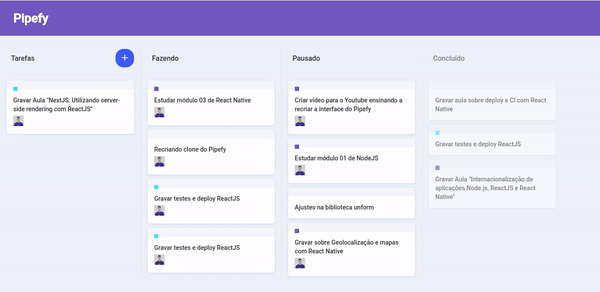

# PipefyClone

Pipefy interface clone made with ReactJS, Drag and Drop

### Demo



## :rocket: Technologies

This project was developed with the following technologies:

- React
- create-react-app
- react-dnd
- react-dnd-html5-backend
- react-icons
- styled-components
- VS Code with EditorConfig and ESLint

## :information_source: How To Use

```bash
# Clone this repository
$ git clone https://github.com/thyagoaraujo/pipefy-clone.git

# Go into the repository
$ cd pipefy-clone

# Install dependencies
$ yarn install

# Run the app
$ yarn start
```

## :memo: License

This project is under the MIT license. See the [LICENSE](https://github.com/thyagoaraujo/pipefy-clone/blob/master/LICENSE.md) for more information.

---

Made with ♥ by Thyago Araujo :wave: [Get in touch!](https://www.linkedin.com/in/thyagosantosaraujo/)
